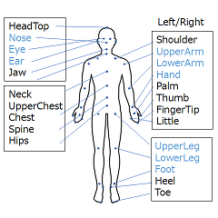

# keypoints-annotation-tool

## 概要
  AISTダンス動画データベース専用のキーポイントアノテーションツールです。

## 事前準備
- **プログラムのダウンロード**  
  このリポジトリをクローンするか、Zipファイルをダウンロードしてください。
  
- **動画のダウロード**  
  AIST Dance Video DataBaseの公式サイトから動画をダウンロードしてください。  
  https://aistdancedb.ongaaccel.jp/  
  （１つのダンスにつき、c01~c08の8つの動画が対象です）
  
- **データのダウンロード**  
  AIST++の公式サイトからcamerasおよびkeypoints2dのデータをダウンロードしてください。  
  https://google.github.io/aistplusplus_dataset/factsfigures.html
  
- **ファイルの構成**  
  以下の図のようにファイルを置いてください
<pre>
.
|
├─ main.exe .. (メインプログラム)
|
├─ config.json .. (設定ファイル)
|
├─ data .. (AIST++のデータファイル)
|   |
|   ├─ cameras
|   |   ├─ mapping.txt
|   |   |      :
|   |   
|   └─ keypoints2d
|       ├─ gBR_sBM_cAll_d04_mBR0_ch01.pkl
|       |               :
|
├─ gBR_sBM_cAll_d04_mBR0_ch01 (AIST Dance Video DataBase の動画ファイル)
|   ├─ gBR_sBM_c01_d04_mBR0_ch01.mp4
|   |                :
|   └─ gBR_sBM_c08_d04_mBR0_ch01.mp4
|
├─ gBR_sBM_cAll_d04_mBR0_ch02
|              :
</pre>
- AIST Dance Video DataBase の動画データは、ダンスごとにcAllというフォルダを作成し、c01~c08までのmp4動画を入れる
- AIST++のcamerasおよびkeypoints2dはzipを解凍してフォルダごとdataに移動させる
  
## キーポイントの説明
以下の説明を参考に、キーポイントのアノテーションを行ってください。  
  
- Hips ... 骨盤（尾てい骨辺り）
- Spine ... 腰（おへその辺り）
- Chest ... みぞおちの辺り（首と骨盤の中間らへん）
- UpperChest ... 胸部
- Neck ... 首の付け根
- HeadTop ... 頭頂
- Jaw ... あご先
- Shoulder ... 肩、肩甲骨の首側
- Palm ... 手のひらの中心部　※見えている場合のみマーク
- Thumb ... 親指の先端
- FingerTip ... 指全体の先端
- Little ... 小指の先端
- Heel ... かかと（靴の後ろ側）
- Toe ... つま先（親指側）

## アノテーションツールの使い方
- **ツールの起動**  
  main.exeを起動（Windowsから警告が出るが、詳細情報→実行を押す）  
  動画が入っているフォルダを選択してOK（このフォルダはどこに置いても良い）  
  ※初回セットアップ時にcannot setup files のエラーが出る場合はファイル構成をもう一度確認してください  
  
- **キーポイントの色について**  
  青色：AIST++でアノテーション済みのキーポイント（ドラッグでの移動不可、削除可能）  
  緑色：手動でアノテーションしたキーポイント  
  赤色：自動でアノテーションされたキーポイント  

- **キーポイントのアノテーション**  
  1. 右側のリストからキーを選択  
  2. 画像上の対応する位置にカーソルを合わせ、右クリックで作成  
  3. 左クリックで選択、ドラッグで動かして位置を調整（右側のボタンでも調整可）  
  （選択しながらDeleteキーを押すことでキーポイントを削除できます）  
  
- **スケルトンの表示**  
  View→Show Skeleton でスケルトン表示が可能（Sキーでも表示・非表示の切り替えが可能）   

- **カメラの切り替え**  
  上部の小さい画像をクリックでカメラの切り替え  

- **フレームの移動**  
  下部のボタンでフレームの移動  
  上下キー：フレームの間隔設定  
  左右キー（Prev, Next）：フレームの移動  
  ※フレームを移動すると、前フレームのアノテーション情報を用いてキーポイントが自動でアノテーションされます。

- **Triangulation**  
  2つ以上のカメラでアノテーションされたキーポイントを、cv2のtriangulate機能を使って3次元座標に変換します。  
  アノテーションがまだ終わっていないカメラに、位置を反映させます。  
  ※2つのカメラ同士の角度が90°のカメラで行うと正確に反映されます。またアノテーション済みのカメラが多いほど正確になります。  

- **Interpolation**  
  前後のフレーム（10フレームまで）を使って、キーポイントの位置を線形補間します。  
  間隔が狭いほど正確に補間できます。  （AISTの場合、間隔が5フレームで誤差が1cm程度）  

- **進捗確認**  
  Tools→Check Progress で進捗が確認できます。  
  右側のリストでキーの絞り込み、グラフは縦軸がアノテーションの達成率（％）で横軸がフレーム番号です。  

- **アノテーションデータの保存**  
  File→Saveでアノテーションデータが保存されます。  
  作業中はこまめに保存してください。  
  
- **ショートカットキー**  
  - カーソルキー左右：フレームの移動
  - カーソルキー上下：フレーム間隔の設定
  - Shiftキー：選択中のキーの切り替え
  - Ctrl+Z：一つ前に戻る
  - S：スケルトンの表示・非表示
  - T：Triangulate
  - I：Interpolate
